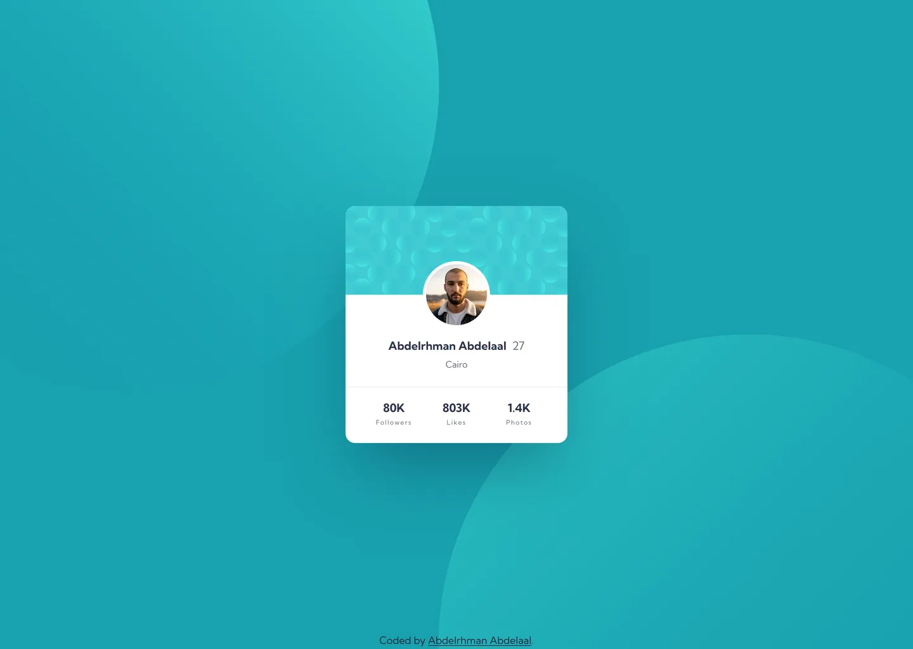

# Profile card component

My solution to the [Profile card component](https://www.frontendmentor.io/challenges/profile-card-component-cfArpWshJ) challenge on Frontend Mentor.

- Live: https://profile-card-component.abdelrhman-ahmed8881.workers.dev
- Code: https://github.com/MrBlackvanta/profile-card-component

## Built with

- Next.js
- React
- TypeScript
- Tailwind CSS
- Cloudflare Workers

## Author

- [LinkedIn](https://www.linkedin.com/in/abdelrhman-vanta/)
- [UpWork](https://www.upwork.com/freelancers/mrblackvanta)
- [Frontend Mentor](https://www.frontendmentor.io/profile/MrBlackvanta)
